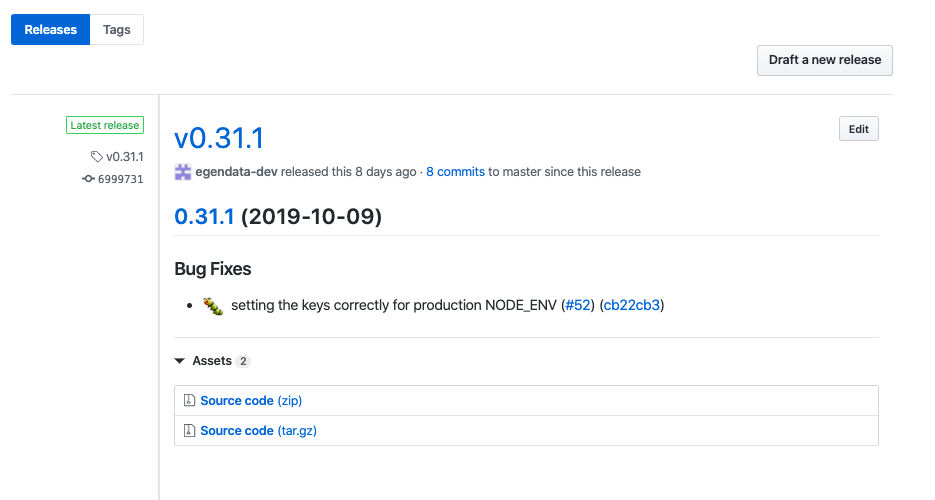
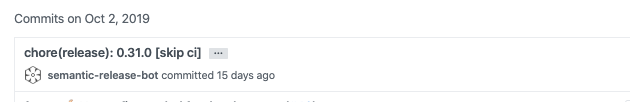

This guide should help you setup from scratch or understand how the CI for [operator](https://github.com/egendata/operator) is configured

## Prerequisites

Before you begin, this guide assumes that...

- ...you have access to the [OpenShift cluster](https://console.dev.services.jtech.se:8443/) or have a functioning OpenShift cluster
- ...you are familiar with OpenShift (and Kubernetes) and have the [OpenShift CLI installed](https://docs.openshift.com/container-platform/3.7/cli_reference/get_started_cli.html#installing-the-cli) version 3.x
- ...you have access to the `mydata` project namespace inside OpenShift (if you use the above existing cluster)
- ...you have access to the [Github organization](https://github.com/egendata)
- ...you are familiar with [Travis CI](https://travis-ci.com/) that is used for automating the CI process
- ...you are familiar with [conventional commits or semantic commit messages](https://www.conventionalcommits.org/en/v1.0.0-beta.2/#summary) and [semantic-release](https://github.com/semantic-release/semantic-release) that we use for automating the package release workflow based on the commit messages
- ...you have access to the [Dockerhub organization](https://cloud.docker.com/u/jobtechswe/repository/list) where we push the Docker images for services that run in OpenShift
- ...you have access to the [NPM organization](https://www.npmjs.com/settings/egendata/packages)

Go ahead and get familiar with the things above, make sure you have access to OpenShift and Github and let's start.

## Step 1 - creating a deployment, service and route in OpenShift (The one where things are done manual)

- All the files for OpenShift are in the [openshift folder](https://github.com/egendata/infrastructure/tree/master/openshift).

- The [README](https://github.com/egendata/infrastructure/blob/master/openshift/README.md) has a generic instructions list how to create every environment but we will go into more details in this tutorial

- If you use the existing [OpenShift project](https://console.dev.services.jtech.se:8443/console/project/mydata/overview) these resources are already created in the cluster

- We choose to store the configurations in Github and use it for version control and then use `oc` to create or apply changes when needed

- We separate environments into separate folders inside the [openshift folder](https://github.com/egendata/infrastructure/tree/master/openshift) (`ci, test, legacy-operator`)

  - `ci` is the environment that uses the latest Docker images (we set the tag `latest` for the Docker image inside the deployment configuration) and is being redeployed automatically through Travis CI when the following conditions are satisfied:
    - code is pushed/merged to the `master` branch
    - `semantic-release` determined that a new release should be created based on the commits since the last release (meaning `chore:` or `docs:` commits do not trigger releases)
  - `test` is the environment that uses semver tags for the Docker images in the deployment configurations and deployments are manual using a [deploy script](https://github.com/egendata/infrastructure/blob/master/openshift/README.md#releasing-a-new-tag-to-test)
  - `legacy-operator` is an environment that runs an older version of the operator that is used by myskills project running in Openshift (the version pre dates the refactor of the protocol)

- All OpenShift resources for a specific environment are grouped using `metadata.labels.app` for example setting `metadata.labels.app: CI` would make it look like this inside OpenShift:
  

- The above grouping is achieved by adding the `label app: CI` or `selector app: CI` as you can see in the `yml` files like (or `TEST` for the test ones):

```yaml
metadata:
  labels:
    app: CI
```

```yaml
selector:
  app: CI
```

- For every environment (let's use [ci](https://github.com/egendata/infrastructure/tree/master/openshift/ci) folder as an example) we divided the resources needed for a specific service into separate files for every OpenShift resource that it needs and they follow the naming convention like `[Service name]-[OpenShift Resource Type].yml`

- So in the case of the operator there would be a [DeploymentConfig](https://github.com/egendata/infrastructure/blob/master/openshift/ci/operator-DeploymentConfig.yml) named `operator-DeploymentConfig.yml`, [Service](https://github.com/egendata/infrastructure/blob/master/openshift/ci/operator-Service.yml) named `operator-Service.yml` and [Route](https://github.com/egendata/infrastructure/blob/master/openshift/ci/operator-Route.yml) named `operator-Route.yml`

- If at this point you are confused with the OpenShift Resource Types (deployment config, service, route) here is a quick explanation:

  - a `DeploymentConfig` is a template for your deployment, here you customize number of replicas you want to run, rolling strategies, Docker image that your containers should run (in some cases you may want to configure even `initContainers` which may be some init command like in the case of the operator where we run `npm run migrate`) and environment variables
  - a `Service` serves as an internal load balancer that identifies a set of pods in order to proxy connections that it receives to them. The use case of a Service is to be able to access a pod created by our deployment with a specified name inside the cluster.
  - a `Route` is the way we expose a `Service` by having an external reachable hostname, and also configure things like TLS. So that means that for some applications that don't need external access, we don't create a Route (like in the case for postgres or redis)

- In theory for the existing project for the `ci` application you should not need to make any changes to the operator files, but when you want to add new environment variables, modify existing ones, change rules for the Service or Route you can make the changes, apply them by running any of the commands related to your changed file and remember to commit and push the changes to Github:

  - `oc apply -f openshift/ci/operator-DeploymentConfig.yml`
  - `oc apply -f openshift/ci/operator-Service.yml`
  - `oc apply -f openshift/ci/operator-Route.yml`

  - sometimes some changes (like for the Route) require you to delete it first (`oc delete -f openshift/ci/operator-Route.yml`) and then apply

- **The same commands apply even when you want to create things from scratch, just make sure you have created the [secrets](https://github.com/egendata/infrastructure/blob/master/openshift/README.md#secrets) and apply the above files plus extra dependencies for the operator (postgres and redis)**:

  - `oc apply -f openshift/ci/postgresql-operator-DeploymentConfig.yml`
  - `oc apply -f openshift/ci/postgresql-operator-Service.yml`
  - `oc apply -f openshift/ci/redis-DeploymentConfig.yml`
  - `oc apply -f openshift/ci/redis-Service.yml`

- If you check the deployment config for operator in the `ci` folder you can see that it uses the `latest` tag of the Docker image and the pull policy is set to Always (which means that it will always try to retrieve the latest from Dockerhub)

```yaml
image: jobtechswe/mydata-operator:latest
imagePullPolicy: Always
```

- Now if you have manually built the Dockerfile in the operator folder and pushed it to Dockerhub you could manually trigger a redeploy from the OpenShift interface by pressing the `Deploy` button as shown below:


- However let's go further and discover how things are automated with Travis

## Step 2 - automating things with Travis and semantic-release (The one where life gets easier)

- We use [Travis CI](https://travis-ci.com/) to build, test and deploy. It is free as long as the project you build is open source

- The way Travis CI works is that everytime your repository is updated (new branch, new commit, new tag) it picks up that branch and will run the specified tasks from your configuration

- We use [semantic-release](https://github.com/semantic-release/semantic-release) for automating the package release workflow based on the commit messages

- The [Travis configuration](https://github.com/egendata/operator/blob/master/.travis.yml) is rather simple and consists of 2 stages (`lint-and-test` and `publish`)

  - `lint-and-test` stage runs for every branch (except `master`) and it will install npm dependencies, run lint and unit tests; This is a good tool that assists you when you review a pull-request as you can see that tests are failing or passing

  - `publish` stage runs only on the `master` branch and it installs the OpenShift cli and then runs `semantic-release`

- We also set several environment variable [inside Travis](https://travis-ci.com/egendata/operator/settings):

  - `DOCKER_PASSWORD` and `DOCKER_USERNAME` for pushing the [Docker image](https://cloud.docker.com/u/jobtechswe/repository/docker/jobtechswe/mydata-operator)

  - `GITHUB_TOKEN` is used for push back to Github a new release, update CHANGELOG (it needs to have write access to the repository)

  - `OPENSHIFT_URL` is the url of the OpenShift cluster

  - `OPENSHIFT_TOKEN` is needed for being able to redeploy the [operator-ci](https://console.dev.services.jtech.se:8443/console/project/mydata/browse/dc/operator-ci?tab=history). [This README](https://github.com/egendata/infrastructure/tree/master/travis#openshift) should explain how to create a service account and retrieve it's token

  - `OPENSHIFT_CERT` is used so that the communication with the cluster is secured. For this we need the intermediate certificate for the cluster and uploading it to Travis. [This README](https://github.com/egendata/infrastructure/tree/master/travis#openshift) should explain how to get the certificate, base64 encode it and then save it as an environment variable

- For `semantic-release` we have the following dev dependencies (plugins) installed at the time of writing this (`semantic-release` comes with a set of plugins included and some we install and explain further down):

```json
"@semantic-release/changelog": "^3.0.4",
"@semantic-release/exec": "^3.3.7",
"@semantic-release/git": "^7.0.16",
"semantic-release": "^15.13.24",
"semantic-release-docker": "^2.2.0",
```

- We mostly use [semantic-release plugins](https://semantic-release.gitbook.io/semantic-release/extending/plugins-list) with the default configuration and the pipeline for it looks as follows as defined in the [.releaserc.json](https://github.com/egendata/operator/blob/master/.releaserc.json)

```json
{
  "plugins": [
    "@semantic-release/commit-analyzer",
    "@semantic-release/release-notes-generator",
    "@semantic-release/changelog",
    [
      "@semantic-release/npm",
      {
        "npmPublish": false
      }
    ],
    "@semantic-release/github",
    "@semantic-release/git",
    [
      "@semantic-release/exec",
      {
        "publishCmd": "docker build -t jobtechswe/mydata-operator ."
      }
    ],
    [
      "semantic-release-docker",
      {
        "registryUrl": "docker.io",
        "name": "jobtechswe/mydata-operator"
      }
    ],
    [
      "@semantic-release/exec",
      {
        "publishCmd": "bash ./.deploy.bash ${nextRelease.version}"
      }
    ]
  ]
}
```

- Now let's dive deeper into each plugin and what and why we do things in this way:

    - `@semantic-release/commit-analyzer` is the one that analyzes commits since the last release and determines if a new and what type of release should be made; It is going to retrieve the latest Git tag from the Github repo and go through the commits made since that tag and determine if a new release should be made (that is if `fix:` or `feat:` commits are present)

    - **!!! IMPORTANT NOTICE: If you add `semantic-release` to a new project and don't want your first release to bump directly to 1.0.0 you should manually create a git tag like `git tag v0.0.0` in case you have initialized your repo version with 0.0.0 in the `package.json` and push the tag to remote before running `semantic-release`. This will make so that it determines the next version based on 0.0.0 !!!**

    - `@semantic-release/release-notes-generator` is the one that makes the release notes look nice like this:

    

    - `@semantic-release/changelog` is the module that creates and updates the [CHANGELOG](https://github.com/egendata/operator/blob/master/CHANGELOG.md)

    - `@semantic-release/npm` is used with the option `"npmPublish": false` (so it won't actually publish to npm) since it's the one that will update the version inside `package.json` which we want updated

    - `@semantic-release/github` is the one that pushes the new tag and release notes back to Github and needs the `GITHUB_TOKEN` environment variable set in Travis

    - `@semantic-release/git` is an extra plugin that we added because we want to commit and push back to Github the updated `CHANGELOG.md` and `package.json`. Without this module the `package.json` is never pushed back to Github, this isn't a problem since `semantic-release` determines the next version based on existing Git tags but it's nice to have it updated. It uses the default configuration and commits with `chore:` which will not trigger a new release.

    

    - `@semantic-release/exec` is used to execute custom shell commands. We use it for building the Docker image and deploying to OpenShift

    **You might notice that we only build the Docker image at this stage. The reason for that is so that we include the updated `package.json` in the new Docker image**

    - `semantic-release-docker` is used for publishing the Docker image to Dockerhub. We specify the name of the registry and image.

    This one will push both the `latest` tag and a semver tag (like `0.31.1` if that is the next version that `semantic-release` determined that it will release)

    - We run `@semantic-release/exec` as the final step where we redeploy the `operator-ci` in OpenShift

 - Taking a look at the contents of [.deploy.bash](https://github.com/egendata/operator/blob/master/.deploy.bash) we login towards the OpenShift cluster using the service account that we have created and run a deploy command and then we logout and delete the certificate from the machine where we ran the Travis tasks:

 ```bash
 oc rollout latest operator-ci -n mydata
 ```

## Step 3 - deploy to the test environment

- If you have followed along so far and have pushed to the `master` branch a commit that is either a `fix:` or a `feat:` or maybe a `feat:` that includes a `BREAKING CHANGES:` you will see that `operator-ci` has redeployed your changes when Travis completed the `publish` stage.

- Now you might want to deploy to `operator-test` in OpenShift.

- As described above in Step 1, you saw how we group resources in OpenShift using an `app:` label/selector.

- The files for the `test` environment are inside the [test folder](https://github.com/egendata/infrastructure/tree/master/openshift/test)

- They are created the same way as we did for `ci` with the difference inside the deployment config being the image that is set to a semver tag `image: jobtechswe/mydata-operator:0.31.1`

- We don't have an automated process for updating the test applications and we run it manual using a [script](https://github.com/egendata/infrastructure/tree/master/openshift#releasing-a-new-tag-to-test)

- This script will check Dockerhub for the tag that you are saying that you want to release, updates the local `yml` file inside the `test` folder, applies them to the cluster and then stages and commits the `yml` file.

- **What is left for you to do is push them back to Github.**