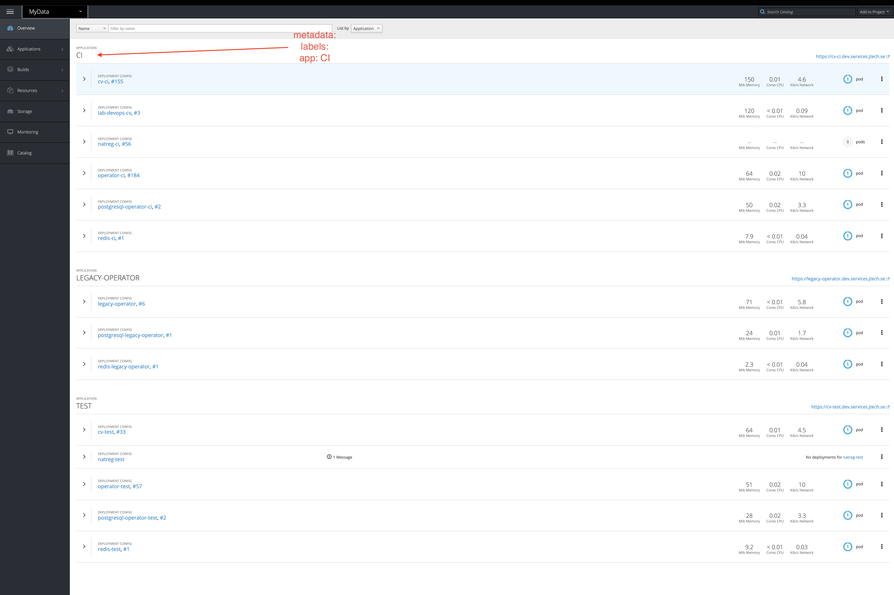
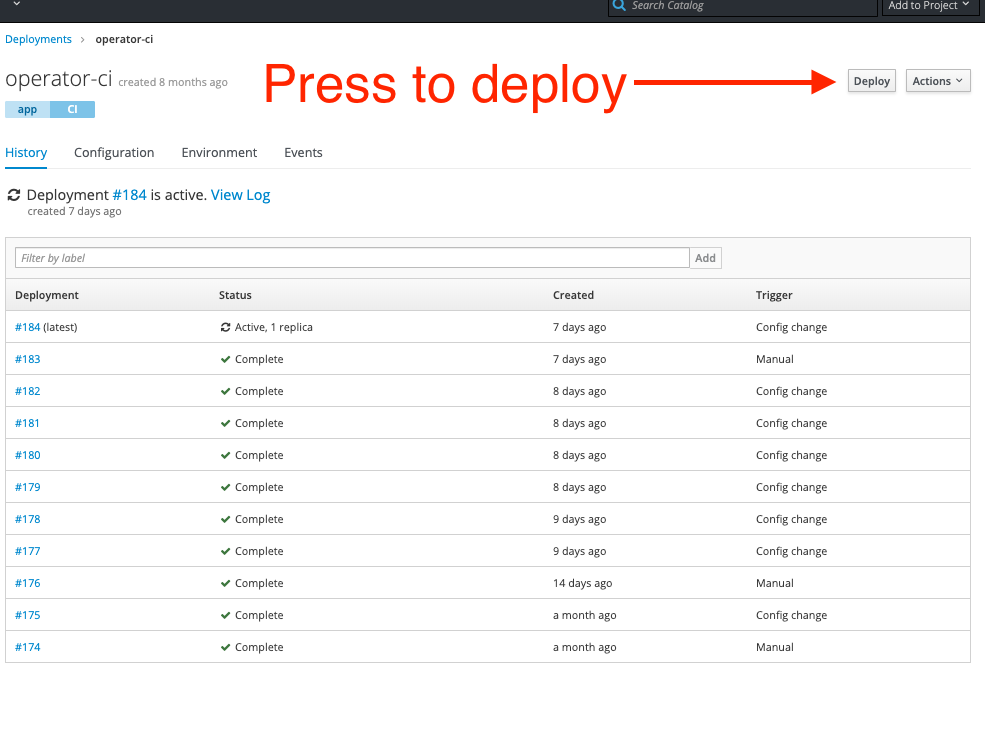

This guide should help you setup from scratch or understand how the CI for [operator](https://github.com/egendata/operator) is configured


## Prerequisites

Before you begin, this guide assumes that...

- ...you have access to the [OpenShift cluster](https://console.dev.services.jtech.se:8443/) or have a functioning OpenShift cluster
- ...you are familiar with OpenShift (and Kubernetes) and have the [OpenShift CLI installed](https://docs.openshift.com/container-platform/3.7/cli_reference/get_started_cli.html#installing-the-cli) version 3.x
- ...you have access to the `mydata` project namespace inside OpenShift (if you use the above existing cluster)
- ...you have access to the [Github organization](https://github.com/egendata)
- ...you are familiar with [Travis CI](https://travis-ci.com/) that is used for automating the CI process
- ...you are familiar with [conventional commits or semantic commit messages](https://www.conventionalcommits.org/en/v1.0.0-beta.2/#summary) and [semantic-release](https://github.com/semantic-release/semantic-release) that we use for automating the package release workflow based on the commit messages
- ...you have access to the [Dockerhub organization](https://cloud.docker.com/u/jobtechswe/repository/list) where we push the Docker images for services that run in OpenShift
- ...you have access to the [NPM organization](https://www.npmjs.com/settings/egendata/packages)


Go ahead and get familiar with the things above, make sure you have access to OpenShift and Github and let's start.

## Step 1 - creating a deployment, service and route in OpenShift (The one where things are done manual)

- All the files for OpenShift are in the [openshift folder](https://github.com/egendata/infrastructure/tree/master/openshift).

- The [README](https://github.com/egendata/infrastructure/blob/master/openshift/README.md) has a generic instructions list how to create every environment but we will go into more details in this tutorial

- If you use the existing [OpenShift project](https://console.dev.services.jtech.se:8443/console/project/mydata/overview) these resources are already created in the cluster

- We choose to store the configurations in Github and use it for version control and then use `oc` to create or apply changes when needed

- We separate environments into separate folders inside the [openshift folder](https://github.com/egendata/infrastructure/tree/master/openshift) (`ci, test, legacy-operator`)
    - `ci` is the environment that uses the latest Docker images (we set the tag `latest` for the Docker image inside the deployment configuration) and is being redeployed automatically through Travis CI when the following conditions are satisfied:
        - code is pushed/merged to the `master` branch
        - `semantic-release` determined that a new release should be created based on the commits since the last release (meaning `chore:` or `docs:` commits do not trigger releases)
    - `test` is the environment that uses semver tags for the Docker images in the deployment configurations and deployments are manual using a [deploy script](https://github.com/egendata/infrastructure/blob/master/openshift/README.md#releasing-a-new-tag-to-test)
    - `legacy-operator` is an environment that runs an older version of the operator that is used by myskills project running in Openshift (the version pre dates the refactor of the protocol)

- All OpenShift resources for a specific environment are grouped using `metadata.labels.app` for example setting `metadata.labels.app: CI` would make it look like this inside OpenShift:


- The above grouping is achieved by adding the `label app: CI` or `selector app: CI` as you can see in the `yml` files like (or `TEST` for the test ones):
```yaml
metadata:
  labels:
    app: CI
```

```yaml
selector:
    app: CI
```

- For every environment (let's use [ci](https://github.com/egendata/infrastructure/tree/master/openshift/ci) folder as an example) we divided the resources needed for a specific service into separate files for every OpenShift resource that it needs and they follow the naming convention like `[Service name]-[OpenShift Resource Type].yml`

- So in the case of the operator there would be a [DeploymentConfig](https://github.com/egendata/infrastructure/blob/master/openshift/ci/operator-DeploymentConfig.yml) named `operator-DeploymentConfig.yml`, [Service](https://github.com/egendata/infrastructure/blob/master/openshift/ci/operator-Service.yml) named `operator-Service.yml` and [Route](https://github.com/egendata/infrastructure/blob/master/openshift/ci/operator-Route.yml) named `operator-Route.yml`

- If at this point you are confused with the OpenShift Resource Types (deployment config, service, route) here is a quick explanation:
    - a `DeploymentConfig` is a template for your deployment, here you customize number of replicas you want to run, rolling strategies, Docker image that your containers should run (in some cases you may want to configure even `initContainers` which may be some init command like in the case of the operator where we run `npm run migrate`) and environment variables
    - a `Service` serves as an internal load balancer that identifies a set of pods in order to proxy connections that it receives to them. The use case of a Service is to be able to access a pod created by our deployment with a specified name inside the cluster.
    - a `Route` is the way we expose a `Service` by having an external reachable hostname, and also configure things like TLS. So that means that for some applications that don't need external access, we don't create a Route (like in the case for postgres or redis)

- In theory for the existing project for the `ci` application you should not need to make any changes to the operator files, but when you want to add new environment variables, modify existing ones, change rules for the Service or Route you can make the changes, apply them by running any of the commands related to your changed file and remember to commit and push the changes to Github:
    - `oc apply -f openshift/ci/operator-DeploymentConfig.yml`
    - `oc apply -f openshift/ci/operator-Service.yml`
    - `oc apply -f openshift/ci/operator-Route.yml`

    - sometimes some changes (like for the Route) require you to delete it first (`oc delete -f openshift/ci/operator-Route.yml`) and then apply

- **The same commands apply even when you want to create things from scratch, just make sure you have created the [secrets](https://github.com/egendata/infrastructure/blob/master/openshift/README.md#secrets) and apply the above files plus extra dependencies for the operator (postgres and redis)**:
    - `oc apply -f openshift/ci/postgresql-operator-DeploymentConfig.yml`
    - `oc apply -f openshift/ci/postgresql-operator-Service.yml`
    - `oc apply -f openshift/ci/redis-DeploymentConfig.yml`
    - `oc apply -f openshift/ci/redis-Service.yml`

- If you check the deployment config for operator in the `ci` folder you can see that it uses the `latest` tag of the Docker image and the pull policy is set to Always (which means that it will always try to retrieve the latest from Dockerhub)

```yaml
image: jobtechswe/mydata-operator:latest
imagePullPolicy: Always
```

- Now if you have manually built the Dockerfile in the operator folder and pushed it to Dockerhub you could manually trigger a redeploy from the OpenShift interface by pressing the `Deploy` button as shown below:



- However let's go further and discover how things are automated with Travis

